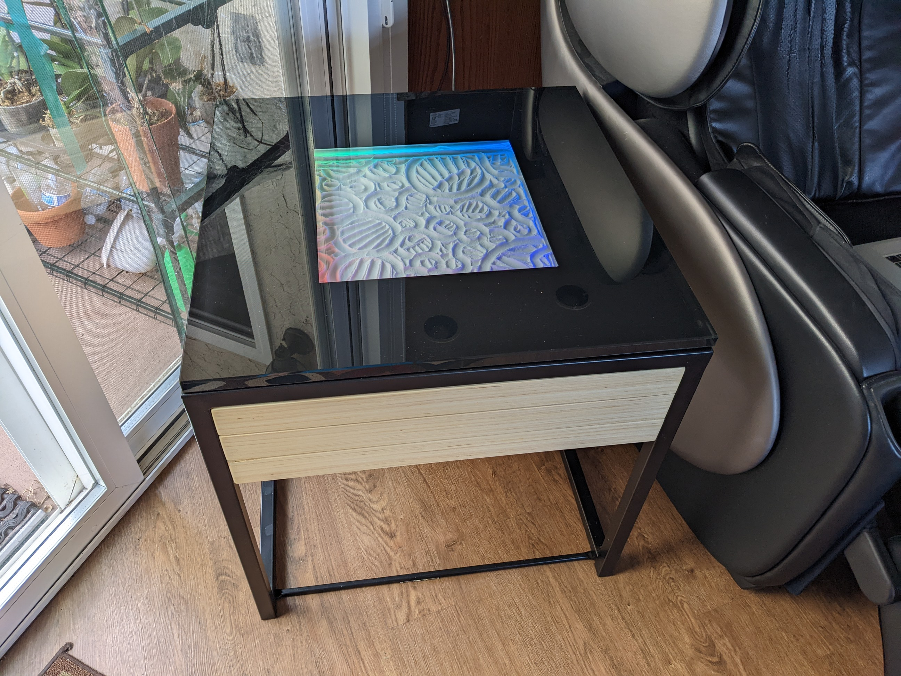
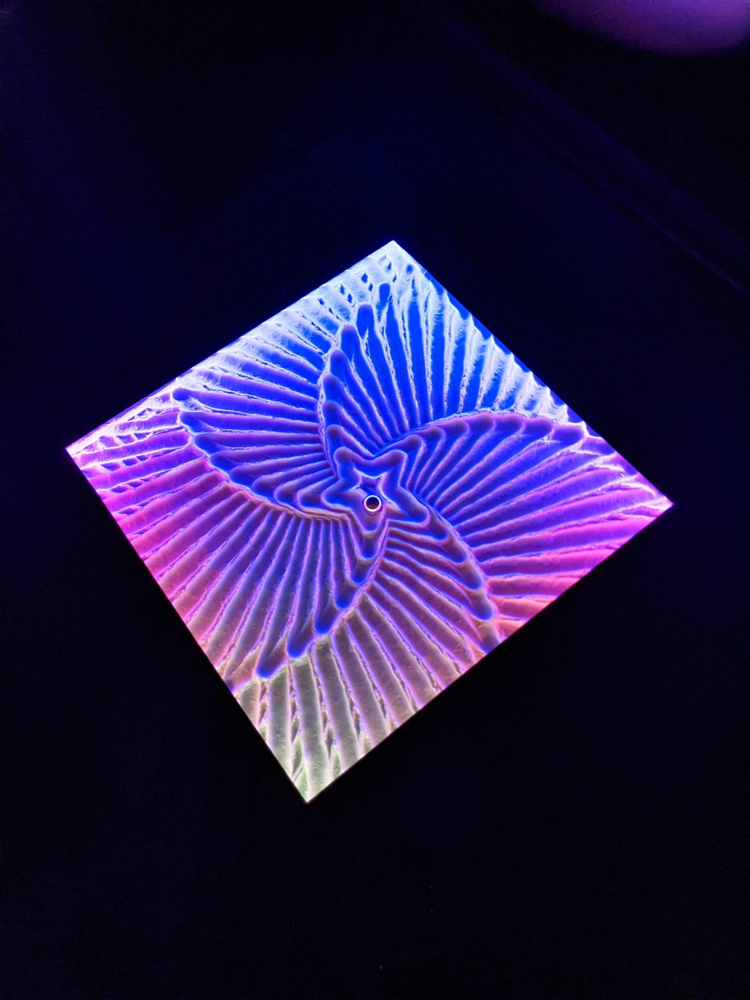
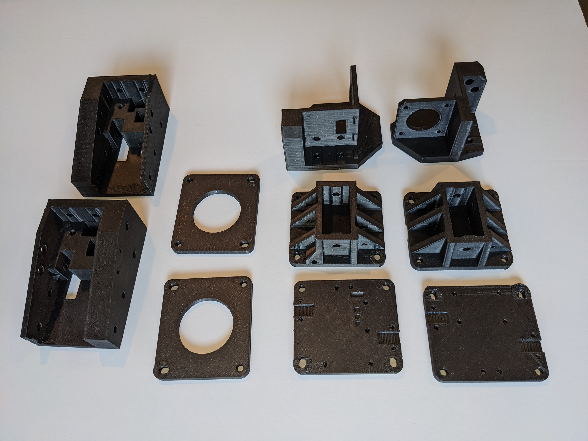
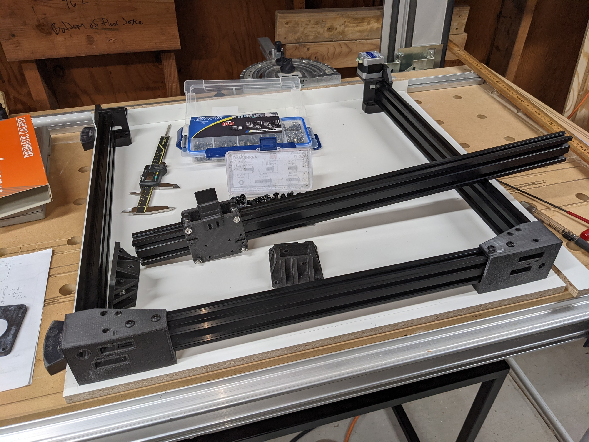
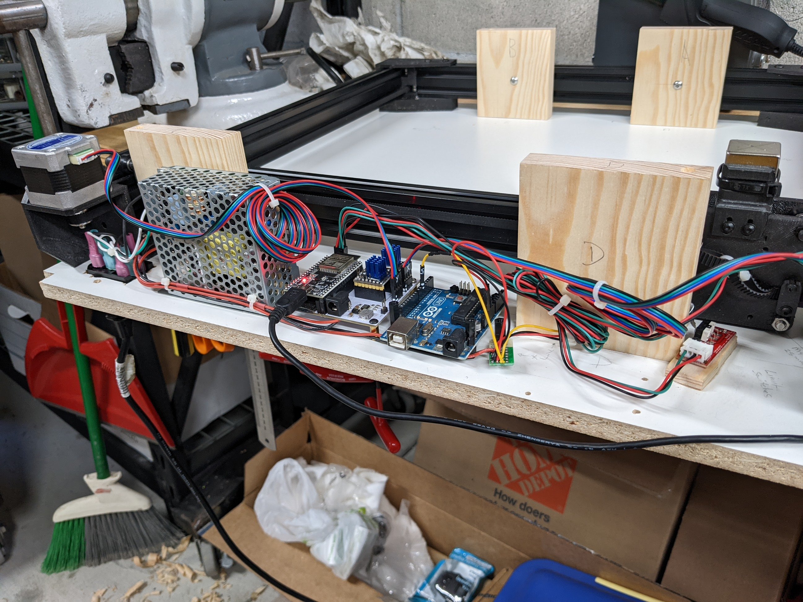
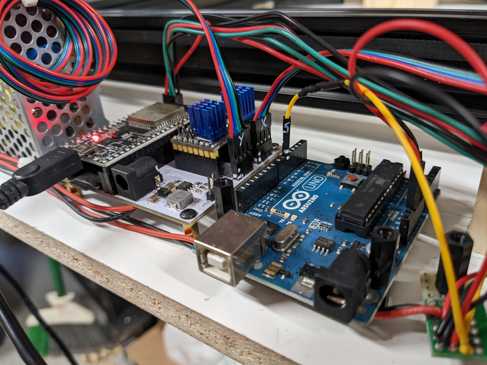
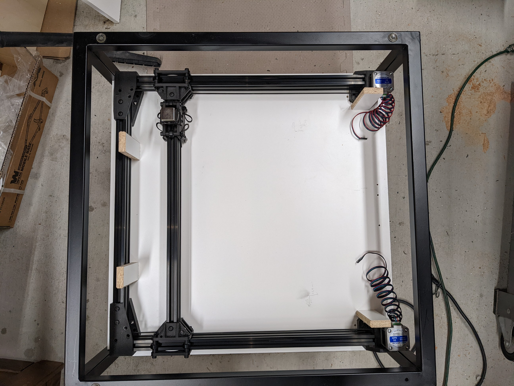

# sandtable1
A sandtable project based on a corexy platform with an ESP32 controller running FluidNC.  I built this a year ago and figured maybe it's worth documenting
while I remember some of the details.

Based upon the excellent [Sand Table and documentation by Ravi Dudhagra](https://github.com/rdudhagra/Sand-Table).

I used printed the plastic bits in black ABS on my [Tiny-M](https://github.com/mark-hoy/tiny-m-build/) printer.

The table itself is a 1/2" of melamine coated MDF with a thin piece of white fabric to minimize noise with baking soda as the media. 
This is reasonably quiet when the steel ball is rolling over it (especially while moving slowly).

I used different software as I had a spare ESP32 based board by Bart Dring from his Tindie project [Pen Plotter Controller Kit for ESP32 & TMC2130](https://www.tindie.com/products/33366583/pen-plotter-controller-for-esp32-tmc2130-v2/).
The initial software for this board was esp32-grbl, but this was outdated and I instead used [FluidNC](https://github.com/bdring/FluidNC). 

The biggest benifit to [FluidNC](https://github.com/bdring/FluidNC) is that you use a pre-compiled one from the GitHub project and create a configuration file (config.yaml) that matches your hardware.

I used the following:  
FW version: FluidNC v3.4.1  
WebUI version: 2.1b72  

Another great thing about FluidNC and the ESP32 controller is that it can be used over WiFi with a simple web browser.

Basic use:
-turn on the machine, bring up the Web GUI and home the machine
-optionally load up a new image to the SD card via the Web GUI
-use the Web GUI to draw an image

For the colored LEDs, I used an Arduino I had laying around running a repetative pattern that works well enough. A future upgrade could replace this with a WiFi based board. 

This is all built into a 2'x2'x2' coffee table that I found on Craigslist for $25. I used black spray paint on the backside of the glass top to frame the area of the sandtable.

